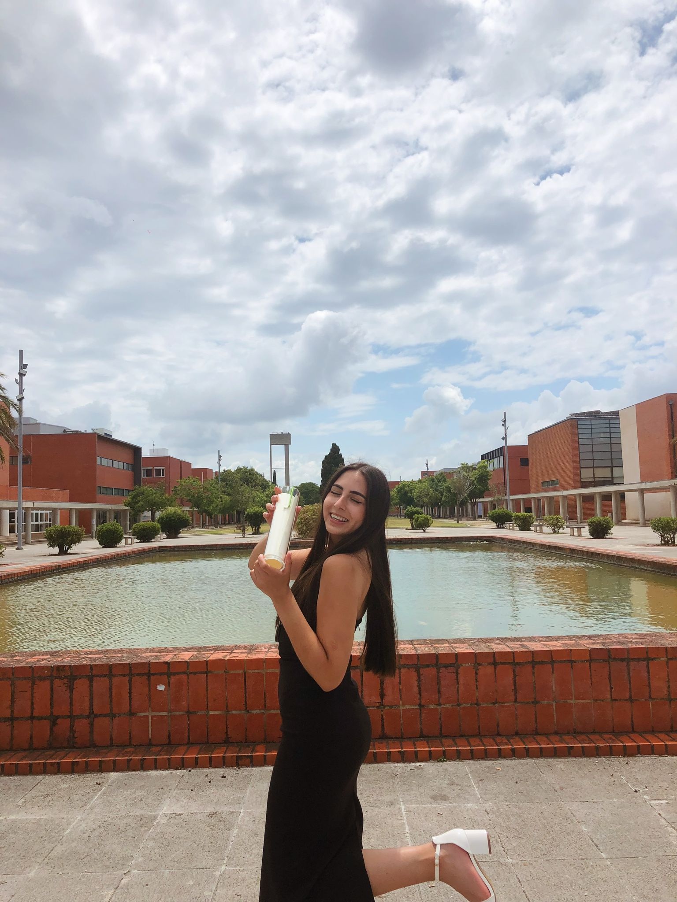

# Entrevista com Catarina Pereira
 

**Foto:** Entrega do diploma de fim da licenciatura em Línguas, Literaturas e Culturas, na Universidade de Aveiro.

**Speaker 1:**
Olá a todos. Estamos aqui para mais uma entrevista Hoje com a Catarina Pereira, que é estudante do segundo ano do Mestrado em ensino de inglês e de língua estrangeira, no terceiro ciclo do ensino básico e no ensino secundário na especialidade de espanhol na Universidade de Aveiro. Hoje esta entrevista tem como objetivo por a trajetória académica da entrevistada identificar. Os momentos decisivos que mudaram suas escolhas e planos futuros. Além disso, procura-se compreender como é essa experiência. Influenciam-se o âmbito, as suas ambições. E estratégias para os próximos anos, oferecendo uma Visão integrada do desenvolvimento pessoal e profissional. Olá Catarina Olá, então mas a primeira pergunta vai ser, **qual foi o momento mais marcante da tua trajetória académica e de que forma influencia os teus planos para o futuro?**

**Speaker 2:**
O momento mais marcante da minha jornal académica até agora foi sem dúvida, quando receber a notícia de que supostamente não tinha entrado no Mestrado que tanto queria. Foi um choque enorme porque tinham preparado e estava mesmo motivada para seguir esse caminho. Portanto, durante uns dias fiquei a pensar em alternativas e comecei a questionar se devia mesmo continuar nessa área ou não. Mas no fim, foi só um engano e acabei por entrar. Apesar do susto, esse momento fez-me perceber o quanto quer mesmo ser professora e quero estar nesse mestrado. E como estou disposta a voltar pelos meus objetivos, Hoje vejo até que serviu para reforçar a minha certeza de que está no percurso, certo?    E que vale a pena não desistir, que que vale a pena não desistir à primeira dificuldade.

**Speaker 1:**
Muito bem. Muito obrigada. Então, a próxima pergunta é, **onde imaginas daqui a 5 anos e quais os os passos pretende dar? Pretende dar para alcançar esta Visão de futuro?**

**Speaker 2:**
Daqui a 5 anos vejo-me então a dar aulas e a fazer aquilo que penso que quero que é ensinar e ao mesmo tempo, aprender com os meus alunos. Espero estar numa escola onde me sinta bem rodeado uma equipa com quem possa partilhar ideias e crescer profissionalmente também. Até lá pretende então continuar a investir na minha formação, explorar novas estratégias e talvez novas áreas também.    E.    E ganhar experiência em prática também Na Na minha área. Sei que o caminho não é sempre fácil, mas acredito que com a dedicação e com vontade, posso ajudar os meus ou NOS alcançarem o melhor deles. E, claro, também crescer como professora e essencialmente como pessoa.

**Speaker 1:**
Muito obrigada Catarina. Foi muito bom ouvir sobre a tua experiência e perspetivas para o futuro e agradecemos imensa a tua disponibilidade e partilha e desejamos muito sucesso no seu projeto e no seu percurso de futuro. Obrigada.

