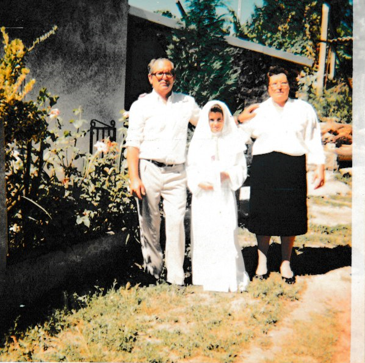

# Entrevista a Maria Machado

<interviewer>Olá, boa tarde. Pode-se apresentar, por favor?</interviewer>

<interviewee>Boa tarde, o meu nome é Maria Machado.</interviewee>

<interviewer>Pronto, Maria Machado, eu vou-lhe fazer algumas perguntas, se puder responder, por favor.</interviewer>

<interviewee>Com certeza.</interviewee>

## Primeira Memória

<interviewer>Qual é a primeira memória feliz que tens da tua infância?</interviewer> 

<interviewee>A minha primeira memória... Sei lá, a minha primeira memória era de dormir com os meus pais, 
ter acesso direto ao quarto dos meus pais, poder dormir com a minha mãe.</interviewee>

<interviewer>Mais nada, mais nenhuma?</interviewer>

<interviewee>Não.</interviewee>

<interviewer>A mais feliz?</interviewer> 

<interviewee>Era o aconchego. Sei lá, ser livre de brincar, sei lá, é tipo isso. Era a minha primeira memória.</interviewee>

## Comida Preferida

<interviewer>Ok. A próxima seria, havia algum desenho animado ou brincadeira de que mais gostavas quando eras criança?</interviewer>

<interviewee>Sim, era com o vizinho da porta, de jogarmos ao supermercado. E tínhamos um banco antigo, onde a gente catávamos os brinquedos velhos que havia lá, 
porque não tínhamos brinquedos novos, e fazíamos de vendinha.Um vendia, outro comprava, depois trocávamos os nossos... As nossas, os nossos papéis. E correr, jogar o escondesconde, coisas assim.</interviewee>

<interviewer>Por fim, qual era a comida ou doce que mais gostavas quando eras mais nova?</interviewer> 

<interviewee>Nunca fui comer muito quando era nova. Mas sei lá, estufado, a carne estufada que a minha mãe fazia. Que era a nossa, a nossa melhor refeição ao domingo. Era carne estufada.</interviewee>

<interviewer>Ok, obrigada Senhora Maria da Conceição, espero que tenham um grande dia.</interviewer> 

<interviewee>Obrigada. Tchau e adeus.</interviewee>
